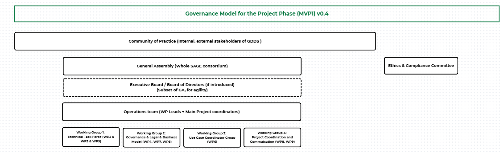
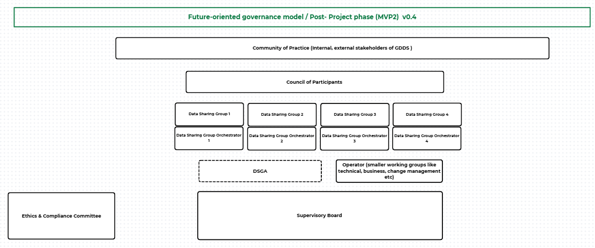

# Organisational Form and Governance Authority

The **Organisational Form and Governance Authority** building block defines the structural foundation and decision-making mechanisms crucial for the effective governance and operation of the Green Deal Data Space (GDDS). Drawing inspiration from established governance models such as the iSHARE Trust Framework and guided by the DSSC Blueprint, GDDS establishes a governance authority that is responsive, transparent, and representative of its participants.

The governance model of the Green Deal Data Space (GDDS) has been developed through an iterative, research-informed, and co-creative process, reflecting both best practices from existing European data spaces and the specific needs of the GDDS ecosystem.

In alignment with the DSSC Blueprint 3.0, the GDDS governance design distinguishes clearly between:

  - > **Organisational Form** – the legal and institutional vehicle that hosts the data space.

  - > **Governance Authority** – the body (or bodies) empowered to define, approve, interpret, and enforce the GDDS Rulebook and related policies.

## Organisational Form 

*Editor's note: This will be discussed in later phases.WP7 and WP4 is working on options for business model, potential legal entity, organisational form. This will be more concrete in phase 2 of the project.*

## Governance Authority and Model

From the outset, governance has been treated as an **evolving framework**, designed to mature alongside the data space itself. Rather than prescribing a single, fixed governance structure from the beginning, the GDDS Governance Model intentionally distinguishes between:

  - > **Project-phase governance (MVP1)**, focused on design, coordination, and enablement, and

  - > **Operational governance (MVP2)**, intended for a fully running data space with active data exchange and long-term sustainability

Early governance concepts explored during initial workshops and research activities focused on identifying relevant governance layers, roles, and responsibilities. These preliminary models emphasised the need for:

  - > multi-layer governance,

  - > separation of governance and operations,

  - > trust and compliance as core governance concerns,

  - > and alignment with the European Green Deal and data space principles.

Building on these foundations, successive co-creation sessions with GDDS participants progressively refined the governance model, incorporating feedback on simplicity, subsidiarity, inclusiveness, and operational feasibility.

The governance model therefore evolves incrementally, with MVP1 establishing the structural foundations and MVP2 representing the intended operational model once the data space becomes fully functional.

## Governance Model for the Project Phase (MVP1)

During the SAGE project phase, the GDDS operates as an unincorporated consortium under the Grant Agreement. The formal organisational form is therefore project-bound and contractual.

The MVP1 governance model represents the current focus of the project and is tailored to the project phase, during which the GDDS is being designed, implemented, and prepared for operation.

MVP1 governance is intentionally:

  - > lightweight and pragmatic,

  - > focused on coordination, rule definition, and co-creation,

  - > supportive of technical and organisational experimentation,

  - > and aligned with project delivery requirements.

The purpose of MVP1 governance is to:

  - > Establish a credible governance baseline

  - > Design and validate the GDDS Rulebook

  - > Test governance processes in a controlled project environment

  - > Prepare institutional continuity toward MVP2

The MVP1 governance structure reflects the current project organisation and includes the following governance bodies:

  - > General Assembly (GA)

  - > Steering Committee (delegated body of the GA, if established - TBD)

  - > Community of Practice

  - > Operations Team and Working Groups

  - > Ethics & Compliance oversight.

## **Governance Authority in MVP1 – General Assembly**

### **Role and Function**

The **General Assembly (GA)** is the formal governing body of the SAGE consortium during the project phase. It operates under the Grant Agreement and represents the collective authority of the consortium partners.

The GA ensures that project activities remain aligned with contractual obligations, strategic objectives, and the overall mission of the GDDS initiative.

Within the MVP1 governance framework, the General Assembly acts as the primary governance authority.

### **Composition**

The General Assembly consists of representatives of all funded consortium partners participating in the SAGE project.

Members participate through the organisational structure of the project, including Work Packages and coordination bodies.

The General Assembly meets:

  - > monthly online, and

  - > approximately every six months in person.

### **Responsibilities & Limitations**

The General Assembly performs both strategic oversight and project governance functions.

Its responsibilities include:

  - > monitoring overall project progress,

  - > reviewing coordination challenges and risk factors,

  - > aligning priorities across technical, governance, and use case domains,

  - > endorsing governance proposals and Rulebook developments,

  - > approving major project-level decisions and deliverables.

The GA also ensures that governance development remains consistent with the **Grant Agreement and Digital Europe Programme requirements**.

The GA may delegate structured strategic preparation tasks to a (GDDS Strategic) **Steering Committee (if established)**, without transferring its contractual authority.

The General Assembly does not:

  - > perform day-to-day operational execution,

  - > directly manage technical implementation tasks,

  - > override contractual obligations defined in the Grant Agreement.

### **Resources**

The General Assembly requires:

  - > administrative and secretariat support,

  - > meeting infrastructure,

  - > access to financial reporting and project management information,

  - > access to legal

## **GDDS Strategic Steering Committee (Delegated Strategic Body)**

### **Function and Role**

The **GDDS Strategic Steering Committee (SSC)** is a proposed governance body designed to strengthen strategic coordination and governance management during the project phase.

If established, the SSC would operate between the General Assembly and the Operations Team, providing structured strategic oversight and supporting the management of governance evolution during MVP1.

The SSC would act under the mandate of the General Assembly and would not replace or override its authority.

### The SSC is conceived as a **transitional governance mechanism** supporting the maturation of the GDDS governance framework during the project phase.

Its functions may evolve in future phases of the data space. In particular, elements of its role may inform the establishment of the **Supervisory Board in the MVP2 governance model**, although its mandate will be formally reviewed at the end of the MVP1 phase.

### **Composition**

The SSC is proposed to consist of approximately **five to seven members**, ensuring balanced representation across governance, technical, and use case perspectives.

Membership may include:

  - > project coordinators,

  - > selected consortium representatives from key domains,

  - > optionally, one independent strategic advisor serving in a non-voting capacity.

Members would be appointed by the General Assembly for the duration of the MVP1 phase.

### **Responsibilities & Limitations**

Under the proposed governance model, the SSC may:

  - > define and update strategic priorities for endorsement by the General Assembly,

  - > review governance proposals and Rulebook drafts before GA validation,

  - > receive and assess escalations originating from the Operations Team or Community of Practice,

  - > determine whether issues should be resolved operationally, escalated to the GA, or referred to compliance oversight mechanisms,

  - > oversee formal governance change mechanisms within the Rulebook framework,

  - > monitor alignment between governance development and project commitments.

The SSC would provide structured reports and recommendations to the General Assembly.

The SSC operates transparently and reports formally to the General Assembly.

Meeting outcomes and minutes are documented and shared with the consortium to ensure visibility of governance discussions and decisions.

Where required, major decisions remain subject to endorsement by the General Assembly.

The SSC does not replace the General Assembly as the project’s contractual authority.

Accordingly, it does not:

  - > execute operational tasks,

  - > directly manage work packages,

  - > override consortium partner rights,

  - > take decisions that fall under the formal authority of the GA.

*Editor’s note: The SSC is currently being considered, this is the proposal for it: [Proposal to Establish a Strategic Steering Committee (SSC).docx](https://insideidc.sharepoint.com/:w:/r/teams/SAGE/Shared%20Documents/WP4%20-%20Governance%20and%20Monitoring%20\(IS\)/T4.1%20-%20Finalise%20GDDS%20Governance%20Framework%20\(co-creation%20activity\)/Inputs/Proposal%20to%20Establish%20a%20Strategic%20Steering%20Committee%20\(SSC\).docx?d=wf43dbc08ed944ac29c7ff9b2b2ca50d3&csf=1&web=1&e=owRT7i)*

## **Advisory & Participation Layer**

### **Role and Function** 

The **Community of Practice (CoP)** represents the broadest and most inclusive engagement layer of the GDDS during the project phase. It functions as an open ecosystem forum designed to support collaboration, knowledge exchange, and stakeholder feedback.

The Community of Practice enables the project to remain closely connected to the broader data space ecosystem and helps ensure that the governance framework reflects the needs, expectations, and experiences of relevant stakeholders.

While the Community of Practice plays an important consultative role, it does not exercise formal governance authority within the project.

Participation in the Community of Practice is open and voluntary. It may include:

  - > members of the SAGE consortium,

  - > potential data providers and data users,

  - > service providers and technology actors,

  - > representatives of other European data spaces,

  - > public authorities and policy actors,

  - > organisations and experts interested in the development of the GDDS.

Participation is non-restricted and may evolve throughout the project as the ecosystem grows.

### **Responsibilities & Limitations**

The Community of Practice contributes to the governance development process through:

  - > providing feedback on governance concepts, Rulebook drafts, and GDDS components,

  - > sharing insights on ecosystem developments, policy trends, and emerging needs,

  - > identifying potential risks, opportunities, and cross-sector synergies,

  - > facilitating dialogue between GDDS and related initiatives.

Through these activities, the Community of Practice supports the legitimacy, transparency, and ecosystem relevance of the governance framework.

The Community of Practice does not exercise binding decision-making authority, but its input informs governance deliberations within the GA and Steering Committee.

### **Resources** 

To function effectively, the Community of Practice requires:

  - > a collaborative engagement platform,

  - > periodic engagement sessions such as workshops or consultations,

  - > light coordination support,

  - > transparent access to relevant documentation.

## **Operational Layer**

### **Function and Role**

The **Operations Team** constitutes the execution layer of the MVP1 governance model. It is responsible for implementing the tasks defined in the Grant Agreement and for developing the technical, operational and governance foundations of the GDDS.

Through coordinated work across technical, governance, business, and use case domains, the Operations Team ensures the delivery of project outputs and supports the development of the future data space infrastructure.

### **Composition**

The Operations Team includes the key operational actors responsible for project implementation, including:

  - > the project coordinators,

  - > work package leaders,

  - > domain experts contributing to specific domain tasks.

Operational coordination is structured across several domains, including:

  - > **Technical development** **(WP2, WP3, WP5),**

  - > **Governance, legal, and business model development (WP4, WP7, WP1)**,

  - > **Use case implementation and coordination (WP6)**,

  - > **project coordination, dissemination, and communication (WP8, WP8)**.

This structure ensures alignment between governance development, technical implementation, and ecosystem engagement.

### **Responsibilities & Limitations**

The Operations Team is responsible for the **day-to-day execution of project activities**.

Its responsibilities include:

  - > delivering work package tasks defined in the Grant Agreement,

  - > developing the technical and organisational components of the GDDS,

  - > drafting governance documents, technical specifications, and supporting materials,

  - > coordinating collaboration across work packages and project partners,

  - > preparing proposals and documentation for governance decisions.

The Operations Team reports to the **General Assembly** and, if established, may coordinate strategic matters with the **Strategic Steering Committee**.

It may also:

  - > receive ecosystem input from the **Community of Practice**, and

  - > escalate ethical or compliance concerns to the **Ethics & Compliance oversight mechanism**.

The Operations Team does not:

  - > take final governance decisions reserved for the General Assembly,

  - > deviate from the commitments defined in the Grant Agreement,

  - > override governance decisions taken by the GA or other authorised bodies.

## **Independent Oversight**

### **Function and Role**

During the project phase, ethical and legal oversight is provided through an **Ethics & Compliance Committee acting as an independent advisory body** supporting the governance framework of the GDDS.

The committee safeguards legal and ethical compliance during the design and implementation of the data space and ensures that governance proposals and operational activities remain aligned with relevant regulatory and ethical standards.

#### The committee does not exercise strategic governance authority and does not participate in operational execution.

#### The committee’s responsibilities include:

  - > conducting legal and compliance assessment

  - > issuing compliance reports and risk assessment

  - > providing policy recommendations to strengthen legal and ethical robustness,

  - > managing escalation pathways in cases of non-compliance.

#### Operational Requirements

To ensure effective and independent functioning, the committee requires:

  - > access to relevant governance, compliance, and audit documentation,

  - > clearly defined escalation and arbitration pathways,

  - > basic financial and organisational support to maintain independence and professional operation.

*Editor’s note: At the time of writing, the MVP1 governance model represents the latest consolidated working version. It is actively being refined through ongoing co-creation activities and should be understood as work in progress, rather than a final or static governance arrangement.*

## Towards Operational Governance (MVP2)

In parallel, a future-oriented governance model (MVP2) has been outlined to describe how governance is expected to function once the GDDS becomes fully operational. Upon completion of the project phase, the GDDS is expected to transition into an incorporated organisational form (e.g., foundation, association, cooperative, or other suitable entity). The exact legal form will be determined before operational launch.

MVP2 governance builds upon the institutional foundations established during MVP1 and introduces:

  - > a formal Council of Participants as governance authority,

  - > domain-level governance through Data Sharing Groups (DSGs),

  - > a professional operational entity responsible for infrastructure and services,

  - > independent oversight bodies ensuring accountability and trust

The MVP1 phase therefore also serves as a testing environment for elements of the future governance model, allowing governance mechanisms to be validated before the full operational launch of the data space.

## **Governance Authority in MVP2 – Council of Participants**

### **Function and Role**

Under MVP2 governance, the **Council of Participants** becomes the primary Governance Authority of the GDDS.

It represents the collective interests of formally admitted participants and ensures that governance decisions reflect the needs and responsibilities of the ecosystem.

The Council provides strategic direction for the data space, establishes governance rules, and ensures that the GDDS operates in accordance with its Rulebook and guiding principles.

### **Composition**

The Council of Participants is composed of representatives of organisations formally admitted to the GDDS.

Representation is designed to ensure balanced participation across stakeholder categories and domains of activity.

Membership may include:

  - > representatives of participating organisations,

  - > Data Sharing Group Orchestrators representing domain clusters,

  - > representatives from different ecosystem roles (data providers, data users, service providers).

*Editor’s note: Representation rules may be further defined in the governance procedures of the GDDS.*

### **Responsibilities & Limitations**

The Council of Participants performs strategic governance functions for the data space.

Its responsibilities include:

  - > approving and amending the GDDS Rulebook,

  - > defining participant rights and obligations,

  - > approving governance policies and cross-domain rules,

  - > establishing onboarding and participation frameworks,

  - > defining the strategic direction and priorities of the data space.

The Council therefore acts as the highest governance authority of the operational GDDS.

While the Council defines governance policies and strategic direction, it does not perform operational execution. Operational implementation of governance decisions is carried out by the GDDS Operator.

### **Coordination and Governance Delegation**

The Council of Participants may delegate certain governance responsibilities to the **Supervisory Board**, enabling efficient governance management between Council meetings.

It also interacts with:

  - > **Data Sharing Groups through the Data Sharing Group Orchestrators** which provide domain-level input,

  - > the **GDDS Operator**, which implements governance decisions.

### **Operational Support**

Effective functioning of the Council requires:

  - > a structured representation framework,

  - > formal consultation and voting procedures,

  - > governance documentation systems,

  - > secretariat support.

This body evolves conceptually from the MVP1 **General Assembly**, ensuring continuity of governance principles across phases.

## **Supervisory Board**

### **Function and Role**

The **Supervisory Board** provides strategic oversight of the operational GDDS.

It acts as a delegated governance body of the Council of Participants and ensures that the data space operates in accordance with its governance framework, principles, and strategic objectives.

The Supervisory Board ensures accountability of the GDDS Operator and safeguards the fairness and transparency of governance processes.

### **Composition**

The Supervisory Board consists of a limited number of members selected to ensure balanced expertise and preferably independence.

Members may include:

  - > independent experts in governance, data sharing, or digital infrastructure,

  - > representatives of key stakeholder groups,

  - > individuals with experience in regulatory, technical, or ecosystem governance matters.

Members preferably do not hold operational roles within the GDDS to ensure independence of oversight.

### **Responsibilities & Limitations**

The Supervisory Board is responsible for:

  - > overseeing implementation of governance decisions,

  - > supervising the activities of the GDDS Operator,

  - > monitoring fairness, inclusivity, and transparency of the data space,

  - > reviewing performance indicators, audits, and system evaluations,

  - > assessing the continued fitness of governance mechanisms.

### The Supervisory Board provides oversight and governance supervision but does not perform operational management. Operational execution remains the responsibility of the GDDS Operator.

### **Coordination**

The Supervisory Board:

  - > oversees the **GDDS Operator**,

  - > receives advice from the **Council of Participants** and ecosystem actors,

  - > interacts with the **Compliance & Ethics Committee** on compliance matters.

### **Operational Requirements**

To ensure independence and effective oversight, the Supervisory Board requires:

  - > access to governance and operational audit information,

  - > an independent operating budget,

  - > analytical and governance support capacity.

## **Advisory Layer**  
**Function and Role**

In the operational phase, the **Community of Practice (CoP)** continues to function as the open ecosystem engagement layer of the GDDS.

While its basic function remains consistent with the project phase, the Community of Practice evolves into a broader forum supporting knowledge exchange, stakeholder engagement, and cross-domain collaboration across the operational data space ecosystem.

The Community of Practice contributes to the long-term legitimacy, transparency, and adaptability of GDDS governance by enabling structured dialogue between the data space and its wider stakeholder environment.

### **Composition**

Participation in the Community of Practice remains open and voluntary.

Members may include:

  - > GDDS participants and members,

  - > data providers and data users,

  - > service providers and technology vendors,

  - > representatives of other data spaces and sector initiatives,

  - > public authorities and regulators,

  - > research institutions and domain experts,

  - > ecosystem actors interested in sustainable data sharing.

As the ecosystem matures, the Community of Practice may expand to include a broader set of stakeholders participating in or interacting with the GDDS.

### **Responsibilities & Limitations**

The Community of Practice continues to perform an **advisory and consultative role**, including:

  - > providing feedback on governance developments and operational practices,

  - > identifying emerging ecosystem needs, opportunities, and risks,

  - > contributing sector knowledge and best practices,

  - > facilitating collaboration with other initiatives and data spaces.

Through these activities, the Community of Practice strengthens ecosystem alignment and supports the continuous improvement of the Green Deal Data Space.

The Community of Practice does not exercise formal governance authority.

It therefore cannot:

  - > take binding governance decisions,

  - > operate or manage GDDS services,

  - > override decisions taken by formal governance bodies.

Its influence is exercised through advisory contributions and structured consultation processes.

### **Coordination and Information Flows**

The Community of Practice interacts with other governance bodies through consultation and information exchange.

It may provide insights and recommendations to:

  - > the **Council of Participants**, and

  - > the **Supervisory Board**.

It receives ecosystem updates from:

  - > the **GDDS Operator**, and

  - > the **Council of Participants** where appropriate.

### **Operational Support**

Effective operation of the Community of Practice requires:

  - > collaboration and knowledge-sharing platforms,

  - > regular engagement formats such as workshops or ecosystem events,

  - > coordination support,

  - > transparent access to non-confidential governance documentation.

## **Domain-Level Governance (Subsidiarity Principle)**

## **Data Sharing Groups (DSGs)**

### **Function and Role**

**Data Sharing Groups (DSGs)** represent domain-specific collaboration structures within the GDDS ecosystem.

Each DSG brings together participants involved in a specific sector, use case, or thematic area and provides a coordination mechanism for domain-level data sharing activities.

DSGs operate within the governance framework defined by the GDDS Rulebook while enabling domain-specific adaptation and coordination.

### **Composition**

DSGs may include participants operating within a specific domain, such as:

  - > data providers,

  - > data consumers,

  - > service providers,

  - > relevant domain stakeholders.

Participation in a DSG reflects engagement in a particular data sharing initiative or sectoral collaboration.

### **Responsibilities & Limitations**

Data Sharing Groups are responsible for implementing the GDDS governance framework within their domain. DSGs retain autonomy within their domain unless decisions have cross-domain implications, in which case escalation to the Council of Participants occurs.

Their responsibilities include:

  - > coordinating domain-specific data sharing initiatives,

  - > applying the GDDS baseline governance rules,

  - > defining domain-specific governance practices consistent with the Rulebook,

  - > ensuring compliance of domain participants with applicable policies.

DSGs therefore play a key role in translating the general governance framework into operational practices within specific domains.

DSGs operate within the governance framework of the GDDS and therefore cannot:

  - > modify the GDDS baseline governance rules independently,

  - > override decisions taken by the Council of Participants or Supervisory Board.

### **Coordination**

DSGs coordinate with:

  - > the **GDDS Operator** for operational support and infrastructure integration,

  - > the **Council of Participants** through representation by DSG Orchestrators.

**Operational Support**

DSGs require:

  - > domain coordination capacity,

  - > access to technical integration support,

  - > governance templates and operational guidance.

## **Data Sharing Group Orchestrators (DSGOs)**

### **Function and Role**

The **Data Sharing Group Orchestrator (DSGO)** acts as the coordination and facilitation role for a Data Sharing Group.

The DSGO ensures that the domain-level governance activities remain aligned with the broader GDDS governance framework and facilitates communication between the DSG and the central governance bodies.

### **Composition**

A DSGO is typically a domain expert appointed or elected by the participants of the Data Sharing Group.

The role requires neutrality and the ability to coordinate across different stakeholders within the domain.

### **Responsibilities**

The DSGO performs several coordination and governance support functions, including:

  - > coordinating participant onboarding within the DSG,

  - > facilitating implementation of domain governance rules,

  - > maintaining relevant domain registries and attestations,

  - > supporting dispute resolution processes,

  - > escalating systemic governance issues to higher governance bodies.

### **Coordination and Escalation**

The DSGO interacts with several governance actors, including:

  - > the **GDDS Operator** for operational coordination,

  - > the **Council of Participants** through representation and consultation processes,

  - > the **Supervisory Board** in cases of governance escalation.

### **Operational Support**

To perform this role effectively, DSGOs require:

  - > access to governance and administrative tools,

  - > registry management capabilities,

  - > structured dispute resolution mechanisms.

**Operational Execution**

The **GDDS Operator** (evolved from the MVP1 Operations Team) becomes the professional operational entity responsible for:

  - > Running shared infrastructure

  - > Maintaining registries and trust services

  - > Executing governance decisions

  - > Providing onboarding tooling

The Operator has operational authority but does not define governance rules. It is also foreseen that there are specific working groups under the Operator, such as Technical, Business, Legal, Change Management, etc. This could be derived from the working groups of MVP1.

## **Oversight & Assurance**

Two independent bodies safeguard system integrity:

  - > **Supervisory Board** – strategic oversight and systemic accountability (as described above)

  - > **Ethics & Compliance Committee** – legal and ethical enforcement authority

In the operational phase of the GDDS, ethical and legal oversight is provided through a **Compliance & Ethics Committee**, designed as a permanent independent body supporting the governance of the operational data space.

This committee ensures that the functioning of the GDDS, its governance framework, and its operational activities remain aligned with applicable regulatory requirements, ethical standards, and responsible data sharing principles.

The Compliance & Ethics Committee is foreseen to consist of five independent experts, ensuring a balanced representation of relevant expertise.

The committee is composed of:

  - > one expert in data protection law,

  - > one expert in open data and data governance regulation,

  - > one expert in data spaces and data sharing governance,

  - > two experts in ethics and responsible data use.

Members must be independent from other governing bodies of the GDDS in order to safeguard neutrality, credibility, and impartial oversight.

The Compliance & Ethics Committee acts as an independent advisory and escalation body responsible for:

  - > safeguarding legal and ethical compliance within the operational data space,

  - > issuing independent assessments and recommendations on legal and ethical matters,

  - > reviewing governance decisions and operational practices for compliance risks,

  - > supporting responsible data governance across the GDDS ecosystem.

In cases of serious non-compliance or systemic ethical risk, the committee may issue binding compliance opinions, subject to the escalation procedures defined in the governance framework.

The committee does not take strategic governance decisions and does not execute operational functions.

The committee performs the following functions:

  - > conducting legal and regulatory compliance assessments,

  - > reviewing governance and operational proposals for ethical and compliance implications,

  - > issuing compliance reports and risk opinions,

  - > recommending governance improvements to strengthen legal and ethical robustness,

  - > supporting dispute resolution processes involving ethical or regulatory concerns,

  - > managing escalation pathways in cases of systemic or unresolved compliance issues.

The Compliance & Ethics Committee receives input from:

  - > the Council of Participants,

  - > the Data Sharing Groups and their orchestration bodies through the council of participants

  - > the GDDS Operator.

The committee may provide opinions or recommendations to:

  - > the Council of Participants,

  - > the Supervisory Board where issues concern systemic governance risks

In cases of unresolved compliance concerns, escalation may occur to the Supervisory Board in cases of structural or systemic governance risks.

To ensure effective functioning and independence, the committee requires:

  - > full access to relevant governance, audit, and compliance documentation,

  - > clearly defined escalation and arbitration procedures,

  - > appropriate financial support ensuring independent professional operation.

In more mature stages of the data space, the oversight framework may be strengthened through:

  - > structured compliance monitoring tools,

  - > dedicated compliance reporting and auditing systems.

## **Transition Logic (MVP1 → MVP2)**

| **MVP1 Body**                 | **Evolves Into (MVP2)**                               |
| ------------------------------------------------------------ | ------------------------------------------------------------------------------------ |
| Community of Practice         | Community of Practice                                 |
| General Assembly              | Council of Participants                               |
| Operations Team               | GDDS Operator                                         |
| Use Case Groups               | Data Sharing Groups                                   |
| Ethics Advisor                | Ethics & Compliance Committee                         |
| (Optional) Steering Committee | May evolve into the Supervisory Board or be dissolved |

### Ongoing Evolution and Refinement

The GDDS Governance Model is designed to **evolve over time**. Governance models, roles, and procedures described in this Rulebook are subject to:

  - > structured review,

  - > formal change processes,

  - > and continued co-creation with stakeholders.

This evolutionary approach ensures that governance remains:

  - > fit for purpose,

  - > aligned with regulatory and policy developments,

  - > responsive to participant needs,

  - > and supportive of long-term sustainability.

*Editor’s note: The governance models described in this Rulebook reflect the current state of design and consensus achieved at the time of writing. In particular, the MVP1 governance model is under active development and will be further refined before finalisation.it*

